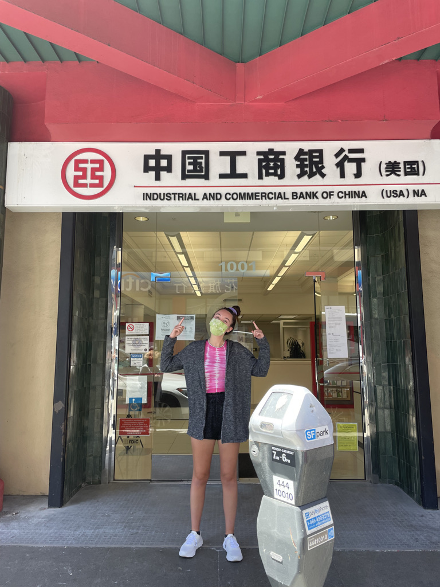
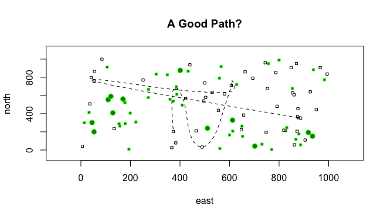

# DATA 444

Week 1 Assignments:

## About me

  

Hi! My name is Samantha Rofman, but I go by Sam! My pronouns are she/her.
I’m a Senior (kinda) studying Data Science and CAMS. I've only actually been on campus for one real semester... Outside of the classroom, I’m involved with Club Rowing, Student Assembly, Peer Advising, AidData, Student Culinary Council, and a developmental biology research lab. I went to San Francisco this summer, and I randomly stumbled across this US Branch of ICBC, which is a Chinese state-owned bank whose activities we track at AidData!
  

  

  

Please enjoy this picture of my dog, Chip, that looks like he accidentally opened the front camera. Still cute though...
  

  
  

  
  

  

  If you're bored, feel free to work through my Pandemic-themed Choose Your Own Adventure: http://www.cs.wm.edu/~skrofman/
  

  
## Path Between Homes

  
  

  

  This plot shows 50 houses represented by the beige squares, 40 small trees represented by small green circles, and 12 large trees represented by large green circles. The spline shows a person's potential route between 7 randomly chosen houses.
  

