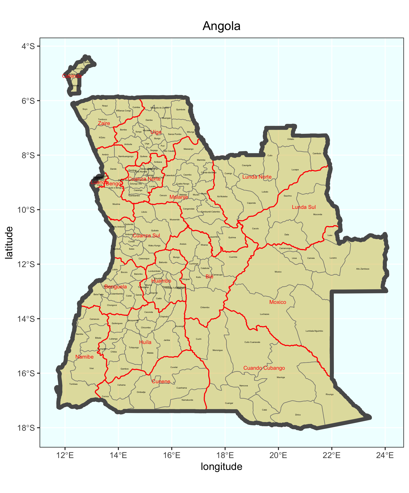
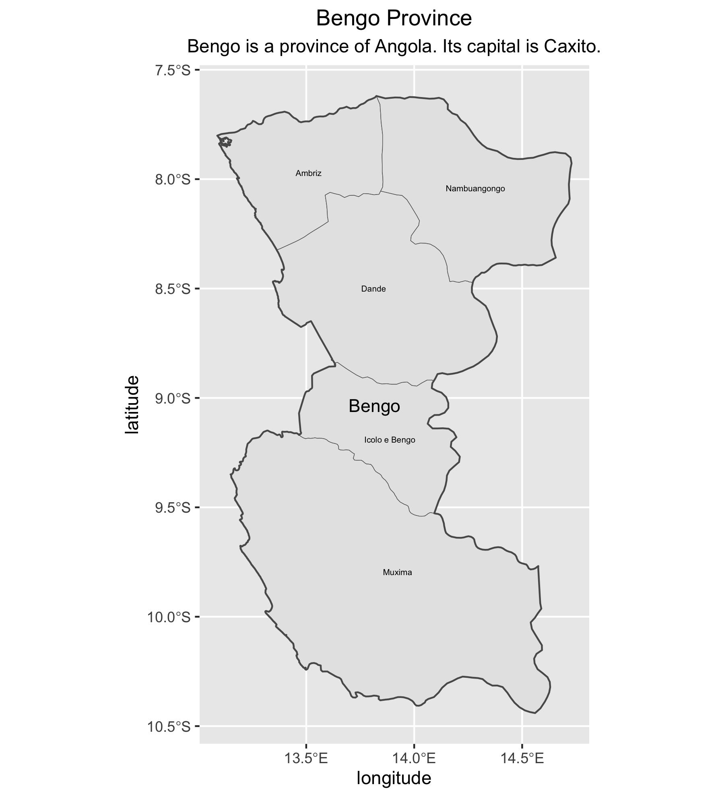
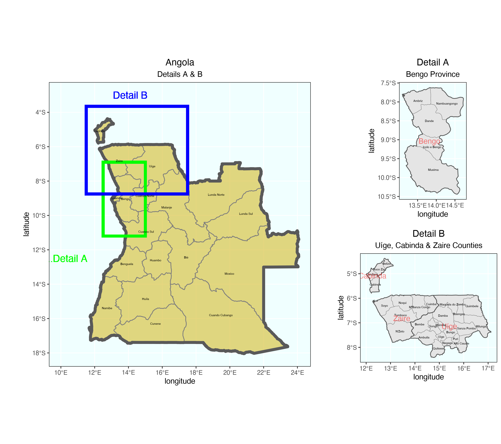

# Mapping Angola

<p align="center">

 </p>
<p align="center">
Angola with labelled provinces
  </p>
  
 ```{r}
# Stretch Goal 1
rm(list=ls(all=TRUE))

# install.packages("tidyverse", dependencies = TRUE)
# install.packages("sf", dependencies = TRUE)

library(tidyverse)
library(sf)

# install.packages("devtools")
library(devtools)

# devtools::install_github("yutannihilation/ggsflabel")
library(ggsflabel)

setwd("~/Documents/DATA_444/wk2/data/angola_shp")

ang_int  <- read_sf("gadm36_AGO_0.shp")
ang_adm1  <- read_sf("gadm36_AGO_1.shp")
ang_adm2  <- read_sf("gadm36_AGO_2.shp")

luanda <- subset(ang_adm1, NAME_1 == "Luanda")

#ggplot() +
#  geom_sf(data = ang_int) +
#  geom_sf(data = luanda)

#ggplot() +
#  geom_sf(data = ang_int)

#ggplot() +
 # geom_sf(data = ang_adm1)

#ggplot() +
  #geom_sf(data = ang_adm2)

ggplot() +
  geom_sf(data = ang_adm2,
          size = 0.25,
          color = "gray50",
          fill = "gold3",
          alpha = 0.4) +
  geom_sf(data = ang_adm1,
          size = 0.5,
          color = "red",
          alpha = 0) +
  geom_sf(data = ang_int,
          size = 2.0,
          alpha = 0) +
  geom_sf_text(data = ang_adm2,
               aes(label = NAME_2),
               size = 0.8) +
  geom_sf_text(data = ang_adm1,
               aes(label = NAME_1),
               size = 2, color = "red") +
  xlab("longitude") + ylab("latitude") +
  ggtitle("Angola") +
  theme(plot.title = element_text(hjust = 0.5),
        panel.background = element_rect(fill = "azure"),
        panel.border = element_rect(fill = NA))

# ggplot() +
#  geom_sf(data = ang_adm2, size = 0.25) +
#  geom_sf(data = ang_adm1, size = 0.75, alpha = 0) +
#  geom_sf_text_repel(data = ang_adm2, aes(label = NAME_2), size = 1.25) +
#  geom_sf_text_repel(data = ang_adm1, aes(label = NAME_1), size = 5, alpha = .5)

ggsave("angola.png")
  ```
  
<p align="center">

 </p>
<p align="center">
The province of Bengo with its 5 labelled municipalities
  </p>

 ```{r}
# Stretch Goal 2
bengo <- ang_adm1 %>%
  filter(NAME_1 == "Bengo")

ang_adm2 %>%
  filter(NAME_1 == "Bengo") %>%
  ggplot() +
  geom_sf(size = .15) +
  geom_sf_text(aes(label = NAME_2),
               size = 1.75) +
  geom_sf(data = bengo,
          size = .5,
          alpha = 0) +
  geom_sf_text(data = bengo,
               aes(label = NAME_1),
               size = 3.75) +
  xlab("longitude") + ylab("latitude") +
  ggtitle("Bengo Province", subtitle = "Bengo is a province of Angola. Its capital is Caxito.") +
  theme(plot.title = element_text(hjust = 0.5), 
        plot.subtitle = element_text(hjust = 0.5))

ggsave("bengo.png")
```


<p align="center">

 </p>
<p align="center">
Angola with 3 northwestern provinces (Uíge, Cabinda & Zaire) and their associated subdivisions (municipalities)
  </p>

 ```{r}
 # Stretch Goal 3
### Create Larger Map of Angola with Rectangles identifying area of Detailed Maps

plot1 <- ggplot() +
  geom_sf(data = ang_adm1,
          size = 0.5,
          color = "gray50",
          fill = "gold3",
          alpha = 0.5) +
  geom_sf(data = ang_int,
          size = 2.0,
          alpha = 0) +
  geom_rect(data = ang_adm1, xmin = 12.5, xmax = 15.0, ymin = -11.2, ymax = -6.9, 
            fill = NA, colour = "green", size = 2) +
  geom_rect(data = ang_adm1, xmin = 11.5, xmax = 17.5, ymin = -8.75, ymax = -3.65, 
            fill = NA, colour = "blue", size = 2) +
  geom_sf_text(data = ang_adm1,
               aes(label = NAME_1),
               size = 1.5) +
  geom_sf_text(data = ang_adm1,
               aes(x = 10.0, y = -12.5, label = ".......Detail A"),
               size = 5,
               color = "green") +
  geom_sf_text(data = ang_adm1,
               aes(x = 14.10, y = -3.0, label = "Detail B"),
               size = 5,
               color = "blue") +
  xlab("longitude") + ylab("latitude") +
  ggtitle("Angola", subtitle = "Details A & B") +
  theme(plot.title = element_text(hjust = 0.5), plot.subtitle = element_text(hjust = 0.5),
        panel.background = element_rect(fill = "azure"),
        panel.border = element_rect(fill = NA))

### Create Detail A Map

bengo <- ang_adm1 %>%
  filter(NAME_1 == "Bengo")

plot2 <- ang_adm2 %>%
  filter(NAME_1 == "Bengo") %>%
  ggplot() +
  geom_sf(size = .15) +
  geom_sf_text(aes(label = NAME_2),
               size = 1.5) +
  geom_sf(data = bengo,
          size = .5,
          alpha = 0) +
  geom_sf_text(data = bengo,
               aes(label = NAME_1),
               size = 3.75,
               alpha = .5,
               color = "red") +
  xlab("longitude") + ylab("latitude") +
  ggtitle("Detail A", subtitle = "Bengo Province") +
  theme(plot.title = element_text(hjust = 0.5), plot.subtitle = element_text(hjust = 0.5),
        panel.background = element_rect(fill = "azure"),
        panel.border = element_rect(fill = NA))

### Create Detail B Map

provinces <- ang_adm1 %>%
  filter(NAME_1 == "Cabinda" | NAME_1 == "Zaire" | NAME_1 == "Uíge")

plot3 <- ang_adm2 %>%
  filter(NAME_1 == "Cabinda" | NAME_1 == "Zaire" | NAME_1 == "Uíge") %>%
  ggplot() +
  geom_sf(size = .15) +
  geom_sf_text(aes(label = NAME_2),
               size = 1.5) +
  geom_sf(data = provinces,
          size = .5,
          alpha = 0) +
  geom_sf_text(data = provinces,
               aes(label = NAME_1),
               size = 3.75,
               alpha = .5,
               color = "red") +
  xlab("longitude") + ylab("latitude") +
  ggtitle("Detail B", subtitle = "Uíge, Cabinda & Zaire Municipalities") +
  theme(plot.title = element_text(hjust = 0.5), plot.subtitle = element_text(hjust = 0.5),
        panel.background = element_rect(fill = "azure"),
        panel.border = element_rect(fill = NA))

ggplot() +
  coord_equal(xlim = c(0, 6.0), ylim = c(0, 4), expand = FALSE) +
  annotation_custom(ggplotGrob(plot1), xmin = 0.0, xmax = 4.0, ymin = 0, 
                    ymax = 4.0) +
  annotation_custom(ggplotGrob(plot3), xmin = 4.0, xmax = 6.0, ymin = 0, 
                    ymax = 2.0) +
  annotation_custom(ggplotGrob(plot2), xmin = 4.0, xmax = 6.0, ymin = 2.0, 
                    ymax = 4.0) +
  theme_void()

ggsave("ang_w_details.png", type="cairo")
```
