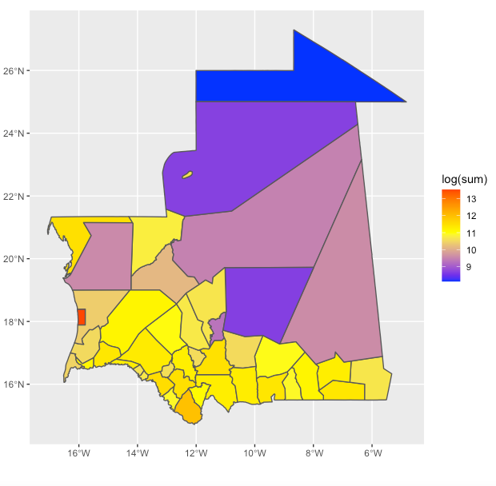
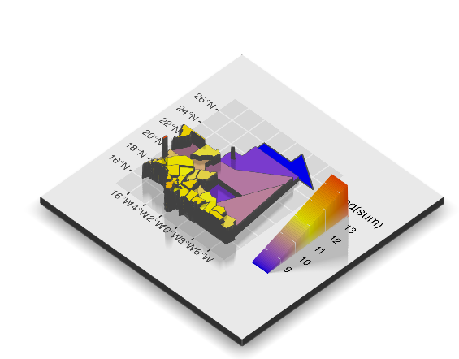

# Maritania Population Maps

<p align="center">

 </p>
<p align="center">
Mauritania with its population
  </p>
  
 ```{r}
# Flatmap
rm(list=ls(all=TRUE))

# install.packages("tidyverse", dependencies = TRUE)
# install.packages("sf", dependencies = TRUE)
# install.packages("raster", dependencies = TRUE)
# 
# install.packages("doParallel", dependencies = TRUE)
# install.packages("snow", dependencies = TRUE)
# 
# install.packages("rgl", dependencies = TRUE) #make sure XQuartz is updated

# remotes::install_github("tylermorganwall/rayshader", dependencies = TRUE)

# install.packages("rayshader", dependencies = TRUE)

# install.packages("prioritizr", repos = "https://cran.rstudio.com/")

# install.packages("Rcpp", dependencies = TRUE)
# install.packages("exactextractr", dependencies = TRUE)
# install.packages("rmapshaper", dependencies = TRUE)

library(tidyverse)
library(sf)
library(raster)
library(rgl)
library(doParallel)
library(snow)
library(devtools)
library(rayshader)

library(prioritizr)
#library(ggsflabel)

library(exactextractr)
library(rmapshaper)
library(Rcpp)

setwd("~/Documents/DATA_444/wk2/data/world_pop")

mrt_pop20 <- raster("mrt_ppp_2020.tif")
mrt_int  <- read_sf("../mrt_shp/gadm36_MRT_0.shp")
mrt_adm1  <- read_sf("../mrt_shp/gadm36_MRT_1.shp")
mrt_adm2  <- read_sf("../mrt_shp/gadm36_MRT_2.shp")

plot(mrt_pop20)
plot(st_geometry(mrt_adm1), add = TRUE)

# ncores <- detectCores() - 1
# beginCluster(ncores)
# pop_vals_adm1 <- raster::extract(mrt_pop20, mrt_adm1, df = TRUE)
# endCluster()
# save(pop_vals_adm1, file = "pop_vals_adm1.RData")

mrt_adm1 <- ms_simplify(mrt_adm1)
mrt_adm2 <- ms_simplify(mrt_adm2)

mrt_adm1 <- st_as_sf(mrt_adm1)
mrt_adm2 <- st_as_sf(mrt_adm2)

mrt_adm2_extract <- exact_extract(mrt_pop20, mrt_adm2, fun=c('sum'), force_df = TRUE)

mrt_adm2 <- bind_cols(mrt_adm2, mrt_adm2_extract)

# flat map pop plot
ggplot(mrt_adm2) +
  geom_sf(aes(fill = log(sum))) +
  scale_fill_gradient2(low = "blue", mid="yellow", high="red", midpoint = 11.0)

```
<p align="center">

 </p>
<p align="center">
Mauritania with its population modelled with an XQuartz 3D plot
  </p>
  
   ```{r}
# 3D map
plot <- ggplot(mrt_adm2) +
  geom_sf(aes(fill = log(sum))) +
  scale_fill_gradient2(low = "blue", mid="yellow", high="red", midpoint = 11.0)

# xquartz plot
plot_gg(plot, multicore = TRUE, width = 5 ,height=4.0, fov = 70)
```
