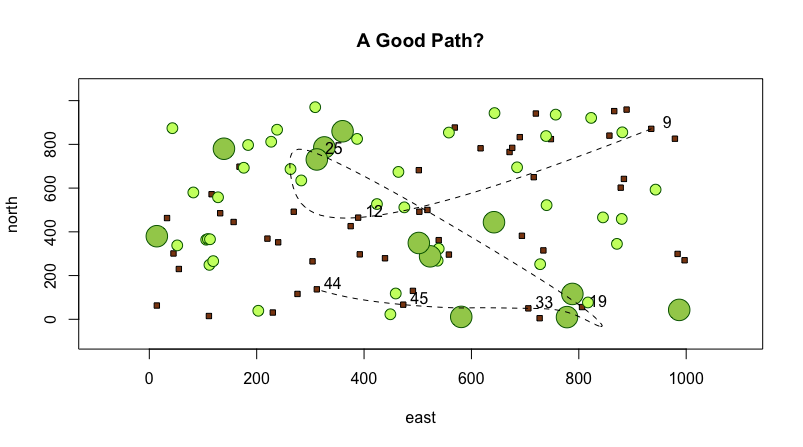

## Path Between Homes
<p align="center">
  
  </p>
  <p align="center">
  This plot shows 50 houses represented by the beige squares, 40 small trees represented by small green circles, and 12 large trees represented by large green circles. The spline shows a person's potential route between 7 randomly chosen houses. See code below.
  </p>

```{r}
x <- 1:1000
y <- 1:1000

east <- sample(x, size = 50, replace = TRUE)
north <- sample(y, size = 50, replace = TRUE)
houses <- cbind.data.frame(id = 1:50, east, north)
symbols(east, north, squares = rep(10,50), inches = FALSE, bg="saddlebrown")

east <- sample(x, size = 40, replace = TRUE)
north <- sample(y, size = 40, replace = TRUE)
small_trees <- cbind.data.frame(id = 1:40, east, north)
symbols(east, north, circles = rep(10,40), inches = FALSE, fg = "darkgreen", bg = "darkolivegreen1", add = TRUE)

east <- sample(x, size = 12, replace = TRUE)
north <- sample(y, size = 12, replace = TRUE)
big_trees <- cbind.data.frame(id = 1:12, east, north)
symbols(east, north, circles = rep(20,12), inches = FALSE, fg = "darkgreen", bg = "darkolivegreen3", add = TRUE)

locs <- sample(50, size = 7)
xspline(x = houses[locs, 2], y = houses[locs, 3], shape = -1, lty = 2)
text(x = houses[locs, ]$east + 30, y = houses[locs, ]$north + 30, labels = houses[locs, ]$id)

title(main="A Good Path?")

```
